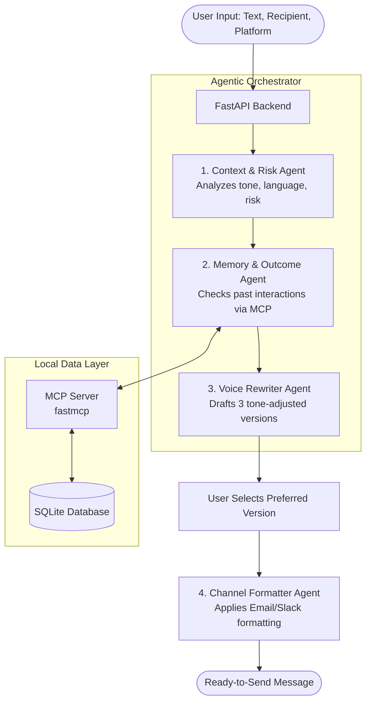

# 💌 RedMes: AI Agentic Message Rewriter

<div align="center">
  <p><strong>Your intelligent, privacy-first emotional buffer for communication.</strong></p>
  <p>
    <a href="#about-the-project">About</a> •
    <a href="#key-features">Features</a> •
    <a href="#architecture">Architecture</a> •
    <a href="#getting-started">Installation</a> •
    <a href="#usage">Usage</a>
  </p>
</div>

---

## 📖 About The Project

**RedMes** ("Ready Message") is a fully local, multi-agent AI system that acts as a protective buffer between your raw emotions and your outgoing communications. 


Whether you're drafting a frustrated email to a boss, a rushed Hinglish text to a friend, or an anxious Slack message to a colleague, RedMes intelligently analyzes the context, assesses escalation risk, and rewrites your message into polished, context-aware alternatives—all while preserving your unique voice.

Built as a capstone project for the **Kaggle AI Agents: Intensive Vibe Coding Hackathon**.

## ✨ Key Features

- 🧠 **Multi-Agent Orchestration:** Powered by Google ADK, chaining specialized agents for context detection, memory retrieval, voice rewriting, and channel formatting.
- 🗣️ **Intelligent Tone & Language Adaptation:** Automatically detects if you're writing in English, Hindi, Hinglish, or a mix, and dynamically adapts the output language based on the recipient (e.g., formal English for a senior, casual Hinglish for a friend).
- 🛡️ **Risk Assessment & Escalation Warnings:** Analyzes emotional volatility and warns you with a visual UI pulse if your draft risks escalating a conflict.
- 💾 **Contextual Memory:** Uses a local SQLite database and an MCP (Model Context Protocol) server to remember past outcomes with specific contacts, helping you avoid repeating communication mistakes.
- 🎨 **State-of-the-Art Glassmorphism UI:** A stunning, responsive frontend featuring ambient aurora backgrounds, animated SVG risk gauges, and smooth staggered micro-interactions.
- 🔒 **100% Local & Private:** No API keys. No cloud data harvesting. Everything runs locally on your machine using Ollama and the `gemma2:9b` model.


## 🏗️ Architecture



## 🛠️ Tech Stack

- **AI & Agents:** Google ADK (Agent Development Kit), Ollama, `gemma2:9b`
- **Backend:** Python, FastAPI, SQLite
- **Integration:** MCP (Model Context Protocol) via `fastmcp`
- **Frontend:** Vanilla JavaScript, HTML5, CSS3 (Custom Glassmorphism Design System)

## 🚀 Getting Started

### Prerequisites

1. **Python 3.10+** installed on your system.
2. **Ollama** installed and running locally. [Download Ollama](https://ollama.com/)

### Installation

1. **Clone the repository:**
   ```bash
   git clone https://github.com/raghavparoli07-art/RedMes.git
   cd RedMes
   ```

2. **Pull the required local LLM:**
   Ensure Ollama is running, then download the Gemma 2 9B model:
   ```bash
   ollama pull gemma2:9b
   ```
   *(Note: This model is highly recommended for reasoning and instruction following, but you can configure a different local model in `llm/llm_client.py` if needed.)*

3. **Install dependencies:**
   ```bash
   pip install -r requirements.txt
   ```

4. **Run the application:**
   Starting the FastAPI server automatically spins up the MCP server and initializes the SQLite database:
   ```bash
   python main.py
   ```

5. **Open the App:**
   Navigate to [http://localhost:8000](http://localhost:8000) in your web browser.

## 🧪 Usage & Testing Scenarios

To fully experience the system's dynamic capabilities, try these specific prompts in the web interface:

**Scenario 1: Cross-Language Formality**
- **Draft:** "kal meeting me baat karte hai, ye code bilkul theek nahi hai yaar."
- **Recipient:** Boss
- **Platform:** Email
- *Observe how the agent translates the frustrated Hinglish into a polite, professional English email.*

**Scenario 2: Casual De-escalation**
- **Draft:** "WHY did you do that without asking me?? you always do this."
- **Recipient:** Friend
- **Platform:** Text
- *Observe the Risk Gauge turn red, the escalation warning banner pulse, and the agent providing softer, constructive alternatives while keeping a casual tone.*

## 🏆 Kaggle Capstone Requirements Mapped

- **Multi-Agent System (Google ADK):** Implemented via `orchestrator.py` linking four distinct agents.
- **MCP Server:** `mcp_server/redmes_server.py` securely handles database interaction and memory retrieval.
- **Security Features:** Database inputs are sanitized, strictly parameterized SQLite queries are used, and `CONTEXT.md` enforces AI behavioral guardrails.
- **Deployability:** Fully self-contained local stack. Zero external API dependencies.

## 🔐 Privacy Guarantee

Your communications are highly sensitive. RedMes is built on a strict privacy-first architecture. **No data ever leaves your local machine.** All AI inference happens locally via Ollama, and your conversation history is stored securely in a local `.sqlite` file.

---
*Built with ❤️ for the AI Agents Intensive Vibe Coding Capstone.*
